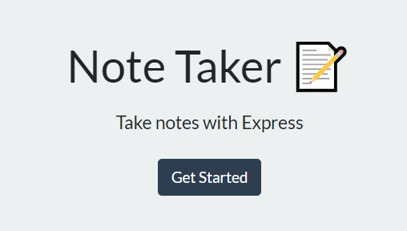
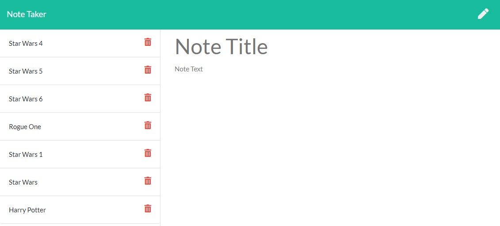

# Note Taker

[](https://opensource.org/licenses/MIT)

## Description

A note taking application that allows the user to take notes and saves them to a 'database' file.  This way the user can save and delete notes at will.

## Table of Contents
  
  * [Installation](#installation)
  * [Testing](#testing)
  * [Useage](#useage)
  * [Technologies](#technologies)
  * [License](#license)
  * [Contact](#contact)
  * [Links](#links)

## Installation

'git clone' from [my repository](https://github.com/TimMartin13/note-taker) and then open the terminal window and navigate to the folder that holds the server.js file. Run

```
npm i
```
to install the *express* npm package. The *nodemon* package is also convenient to install, just type

```
npm i --save-dev nodemon
```
into the terminal window.


## Testing

[](https://drive.google.com/file/d/1W3nJesjWDm_XUQmXTWDA1mEhQM6q8VDB/view?usp=sharing "Testing with star wars notes")

Manually tested with various Star Wars information.

## Useage
The easy way: click on the Heroku link in the Links section of this document, then click the Get Started button that looks like this:



You will be taken to the notes page which looks similar to this:



To enter a new note, click on the "Note Title" text to enter a new title for your note. Then click on "Note Text" to enter the note that you would like to remember.  Once you have entered something for both title and text, a save button will show up in the upper right hand corner of the page, right next to the new note (pencil) button.


Once you select save, your note will move over to the left side of the page with the other notes. You can click on the title of your note to see it in the big window again or you can click the garbage can to delete your note.


## Technologies

JavaScript, node.js, npm packages(express, nodemon, fs, path), HTML, CSS 

## License

Licensed under the [MIT](https://choosealicense.com/licenses/mit/) license 

## Contact

Email: timmartin13@gmail.com

Github: [TimMartin13](https://github.com/TimMartin13)

## Links

Heroku: https://fathomless-dusk-84204.herokuapp.com/

Github: https://github.com/TimMartin13/note-taker


